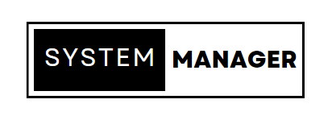

# System Manager

## Introduction

System Manager is a simple yet powerful way to manage your Windows device inside a CLI environement. It allows the view of your whole desktop data in one place, and control your device easily.

## Commands

Here are the currently available commands.

`!shutdown`: Shut down your device.
`!restart`: Restart your device.
`!rerun`: Load the data again in order to see the newest information.

## Usage

You can use the app directly only by downloading the precompiled `.exe` file. If the file isn't working on your device, you can compile it manually through the provided `.cpp` file.

## Conclusion

This is the first version of System Manager. As the app gains popularity, we might add more versions to the app. If you encounter any bugs or issues, please contact me throught the contact information given in the `.cpp` file.
